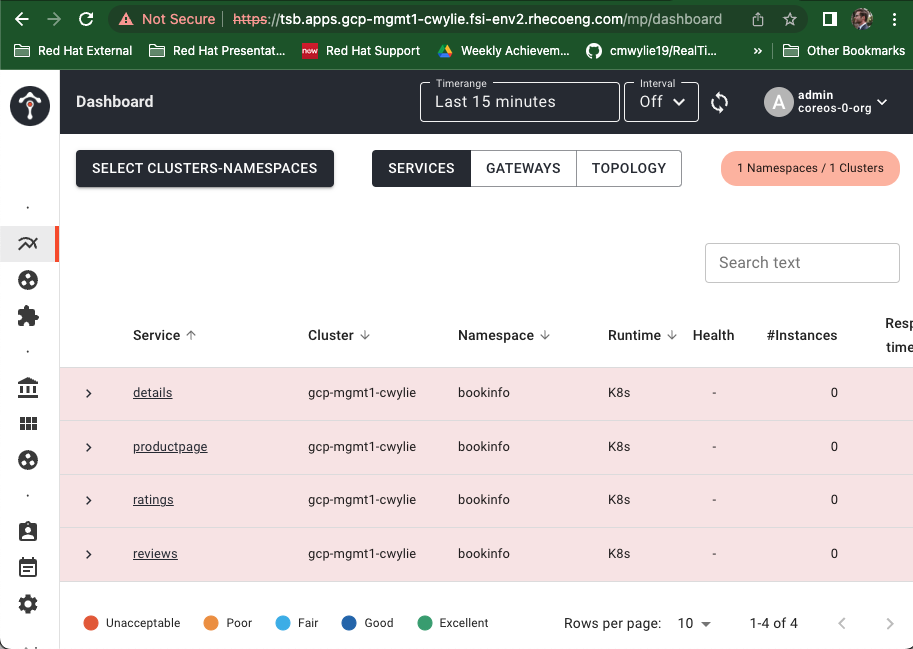

# TSB Install via Scripts


- [Sync Images](#sync-images)
- [Prereqs](#prereqs)
- [Management Plane](#management-plane)
- [Control Plane](#control-plane)
- [Validate](#validate)
- [Clean Up](#clean-up)

## Sync Images

- IGNORE THIS, continue to prereqs!! - 

The first step of using TSB is syncing the images to your own personal image repository. These step is already done for Red Hat's work with Tetrate. _You can skip this step._

- Make sure `demo-scripts/deployment/00-download.sh` has your repo under `REPO` on line 3.

Run script to pull images and push to your personal image repo:

```bash
./demo-scripts/deployment/00-download.sh coreos
```

## Prereqs

Configure credentials and prepare scripts to run   

We are running TSB on a single cluster for now, therefore the `OC_PASSWORDS`, `CLUSTER_LIST` will have on element in the array, leave the second array element as is to preserve the structure of the files.

- Copy the `bash` section of `credentials.md` to `~/credentials.env` and ensure `APIUSER` and `APIKEY` are adjusted according to the credentials given by Tetrate. `OC_PASSWORDS` should be the OpenShift kubeadmin passwords.

Configure `demo-scripts/variables/coreos.env`

- line 11 should be the Clusters names according to the ingress, obtained by (this must be precise):
   -  `kubectl get ingresses.config/cluster --template='{{.spec.domain}}' | sed 's/apps.//g' | cut -f1 -d"."`
- line 14 is the DNS_DOMAIN, obtained by (this must be precise): 
   -  `kubectl get ingresses.config/cluster --template='{{.spec.domain}}' | sed 's/apps.//g' | cut -f2-4 -d"."`
- line 24 should be the OCP kubeadmin passwords in an array. (again, only the first element)

Download and install [tctl](https://docs.tetrate.io/service-bridge/1.5.x/en-us/reference/cli/guide/index#installation), make sure you are installing `1.5.0` so that the images that have been pushed work correctly.

## Management Plane

Deploy Management Plane: 

```bash
./demo-scripts/deployment/01-deploy-management-plane.sh coreos
```

- line 12 of `demo-scripts/deployment/01-deploy-management-plane.sh` shows the images are being pulled from my personal repository, this is okay, **keep this**.

At the end of the running this script, you will see an output similar to the following:

```bash
==========================
TSB UI Access
--------------------------

https://tsb.apps.gcp-mgmt1-cwylie.fsi-env2.rhecoeng.com

Credentials are admin/Tetrate1
```

- Go to the URL in the browser and see **Your connection is not private** warning
- click on the background of the webpage
- type "thisisunsafe"
- sign in with admin and Tetrate1


## Control Plane

Generate the script to deploy the control plane: 

```bash
 ./demo-scripts/deployment/02a-manual-deploy-cp.sh coreos 0
```

The output after running the above script will show:

```bash
Examine file /tmp/command-xxxx.sh and apply commands accordingly
```

To deploy the actual manifests on the CP, run the shell script

```bash
bash /tmp/command-xxxx.sh
```

Watch the logs of the TSB Operator while the control plane installs, there will be errors at first and the operator will restart, keep watching:

```bash
kubectl logs -n istio-system -l name=tsb-operator -f
```

If you get a cert-manager error, (which you will):

```bash 
2022-09-01T18:42:17.635024Z     error   controller.controlplane-controller      Reconciler error        {"name": "controlplane", "namespace": "istio-system", "error": "cert-manager already installed but not owned by tsb operator. Try setting managed: EXTERNAL"}
```

Patch  the control plane operator to set the cert-manager as externally managed (in a new tab while the script continues to run):

```bash
kubectl -n istio-system patch controlplanes.install.tetrate.io controlplane --type='json' -p='[{"op": "add", "path": "/spec/components/internalCertProvider/certManager", "value": {"managed": "EXTERNAL"}}]'
```

After the script runs you should be fully installed.


## Validate

- Go to the UI
- on the left side, under "Tenant", click "Dashboard"
- click "SELECT CLUSTER-NAMESPACES"
- under tenant, select "partner-validation-tenant", namespace "bookinfo", select the box
- click select

You should see:



## Clean Up

Data Planes take care of deploying ingress gateways, step one is to delete all the `IngressGateways`:

```bash
kubectl delete ingressgateways.install.tetrate.io \
    --all --all-namespaces
```

To gracefully remove the `istio-operator` deployment, scale and delete remaining objects in the data plane operator namespace:

```bash
kubectl -n istio-gateway scale deployment \
    tsb-operator-data-plane --replicas=0
kubectl -n istio-gateway delete \
    istiooperators.install.istio.io --all
kubectl -n istio-gateway delete deployment --all
```

Clean up the validation and mutation webhooks for the data planes:

```bash
kubectl delete \
    validatingwebhookconfigurations.admissionregistration.k8s.io \
    tsb-operator-data-plane-egress \
    tsb-operator-data-plane-ingress \
    tsb-operator-data-plane-tier1
kubectl delete \
    mutatingwebhookconfigurations.admissionregistration.k8s.io \
    tsb-operator-data-plane-egress \
    tsb-operator-data-plane-ingress \
    tsb-operator-data-plane-tier1
```

Delete IstioOperator for the control planes:

```bash
kubectl delete controlplanes.install.tetrate.io --all --all-namespaces
```

Clean up the validation and mutation webhooks for the control planes:

```bash
kubectl delete \
    validatingwebhookconfigurations.admissionregistration.k8s.io \
    tsb-operator-control-plane
kubectl delete \
    mutatingwebhookconfigurations.admissionregistration.k8s.io \
    tsb-operator-control-plane
kubectl delete \
    validatingwebhookconfigurations.admissionregistration.k8s.io \
    xcp-edge-istio-system
```

Delete the deployments in the control plane:

```bash
kubectl  delete deploy -n istio-system --all --force 
```

Delete the Cluster 

```bash
tctl delete cluster tetrate
```

Delete the Tenant

```bash
tctl delete tenant partner-validation-tenant
```


Clean up cluster-scoped resources: (TODO)

```bash
kubectl delete clusterrole xcp-operator-edge
kubectl delete clusterrolebinding xcp-operator-edge
```

Clean up management plane cr: 

```bash
kubectl -n tsb delete managementplanes.install.tetrate.io --all
```

Clean up management plane operator:

```bash
kubectl -n tsb delete deployment tsb-operator-management-plane
```

Clean up the validation and mutation webhooks for the management plane:

```bash
kubectl delete \
    validatingwebhookconfigurations.admissionregistration.k8s.io \
    tsb-operator-management-plane
kubectl delete \
    mutatingwebhookconfigurations.admissionregistration.k8s.io \
    tsb-operator-management-plane
kubectl delete \
    validatingwebhookconfigurations.admissionregistration.k8s.io \
    xcp-central-tsb
kubectl delete \
    mutatingwebhookconfigurations.admissionregistration.k8s.io \
    xcp-central-tsb
```

Clean up the control plane CRDs:

```bash
kubectl delete crd \
    clusters.xcp.tetrate.io \
    controlplanes.install.tetrate.io \
    edgexcps.install.xcp.tetrate.io \
    egressgateways.gateway.xcp.tetrate.io \
    egressgateways.install.tetrate.io \
    gatewaygroups.gateway.xcp.tetrate.io \
    globalsettings.xcp.tetrate.io \
    ingressgateways.gateway.xcp.tetrate.io \
    ingressgateways.install.tetrate.io \
    securitygroups.security.xcp.tetrate.io \
    securitysettings.security.xcp.tetrate.io \
    servicedefinitions.registry.tetrate.io \
    serviceroutes.traffic.xcp.tetrate.io \
    tier1gateways.gateway.xcp.tetrate.io \
    tier1gateways.install.tetrate.io \
    trafficgroups.traffic.xcp.tetrate.io \
    trafficsettings.traffic.xcp.tetrate.io \
    workspaces.xcp.tetrate.io \
    workspacesettings.xcp.tetrate.io \
    --ignore-not-found
```

Clean up the management plane CRDs:

```bash
kubectl delete crd \
    centralxcps.install.xcp.tetrate.io \
    clusters.xcp.tetrate.io \
    egressgateways.gateway.xcp.tetrate.io \
    egressgateways.install.tetrate.io \
    gatewaygroups.gateway.xcp.tetrate.io \
    globalsettings.xcp.tetrate.io \
    ingressgateways.gateway.xcp.tetrate.io \
    ingressgateways.install.tetrate.io \
    managementplanes.install.tetrate.io \
    securitygroups.security.xcp.tetrate.io \
    securitysettings.security.xcp.tetrate.io \
    servicedefinitions.registry.tetrate.io \
    serviceroutes.traffic.xcp.tetrate.io \
    tier1gateways.gateway.xcp.tetrate.io \
    tier1gateways.install.tetrate.io \
    trafficgroups.traffic.xcp.tetrate.io \
    trafficsettings.traffic.xcp.tetrate.io \
    workspaces.xcp.tetrate.io \
    workspacesettings.xcp.tetrate.io
```


Clean up the application namespace:

```bash
# Kubernetes Resources
kubectl delete deploy,rolebinding,role --all --force --grace-period=0 -n bookinfo

# Secondary Kubernetes Resources
kubectl delete endpointslice,ep,svc,sa,secret,podmetrics,cm,hpa,poddisruptionbudget,po -n bookinfo --all --force --grace-period=0 -n bookinfo
```


Clean up the Data Plane:

```bash
# Secondary Kubernetes Resources
kubectl delete po,cm,secret,svc,ep,lease,endpointslice,podmetrics,job,cronjob --all --force --grace-period=0 -n istio-gateway
```

Clean up the Control Plane:

```bash
# TSB Resources & manually remove finalizer from istiooperator
# xcp-edge-internal edge-validation
kubectl delete lease,controlplane,gatewaygroup,istiooperator,edgexcp,workspace,edgedirectory --all -n istio-system

# Network Resource
kubectl delete net-attach-def --all -n istio-system

# Istio Resources
kubectl delete dr,envoyfilter --all -n istio-system

# Cert Manager resource
kubectl delete issuer,certificaterequests,certificates --all -n istio-system

# Kubernetes Resources
kubectl delete deploy --all -n istio-system

# Secondary Kubernetes Resources
kubectl delete po,svc,ep,sa,hpa,rolebinding,role,hpa,endpointslice,podmetrics,poddisruptionbudget,job,cronjob --force --grace-period=0 --all -n istio-system

```

Clean Up the Management Plane:

```bash
# TSB resources
kubectl delete cluster,workspace,gatewaygroup,ingressgateway,tier1gateway,managementplane,centralxcp --all -n tsb

# Cert Manager resource
kubectl delete issuer,certificaterequests,certificates --all -n tsb

# Kubernetes Resources
kubectl delete deploy,netpol --all -n tsb

# Secondary Kubernetes Resources
kubectl delete po,cm,ep,pvc,route,svc,rolebinding,role,svc,sa,job,secret,cronjob,podmetrics --force --grace-period=0 --all -n tsb
```

Clean Up the xcp-multicluster namespace:

```bash
# Istio Resources
kubectl delete dr,se --all -n xcp-multicluster

# Kubernetes Resources
kubectl delete cm,secret,sa,role,rolebinding,po,job,cronjob --force --grace-period=0  --all -n xcp-multicluster
```


Clean Up the Cert-Manager namespace:

```bash
# Cert-manager Resources
kubectl delete clusterissuer --all

# Kubernetes Resources
kubectl delete deploy,ep,endpointslice,podmetrics --all  -n cert-manager

# Secondary Kubernetes Resources
kubectl delete cm,secret,sa,role,rolebinding,po,job,cronjob --all --force --grace-period=0 -n cert-manager
```


Clean Up cluster scoped resources:

```bash
kubectl get clusterrole | grep tsb | awk '{print $1}' | xargs kubectl delete clusterrole  

kubectl get clusterrole | grep istio | awk '{print $1}' | xargs kubectl delete clusterrole  

kubectl get clusterrole | grep cert-manager | awk '{print $1}' | xargs kubectl delete clusterrole 

kubectl get clusterrolebinding | grep tsb | awk '{print $1}' | xargs kubectl delete clusterrolebinding  

kubectl get clusterrolebinding | grep istio | awk '{print $1}' | xargs kubectl delete clusterrolebinding  

kubectl get clusterrolebinding | grep cert-manager | awk '{print $1}' | xargs kubectl delete clusterrolebinding
```

Clean Up the CRDS:

```bash
# Tetrate CRDs
kubectl get crd | grep tetrate | awk '{print $1}' | xargs kubectl delete crd

# Cert-manager CRDs
kubectl get crd | grep cert-manager | awk '{print $1}' | xargs kubectl delete crd
```
